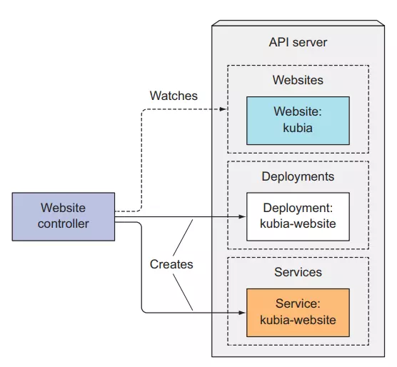
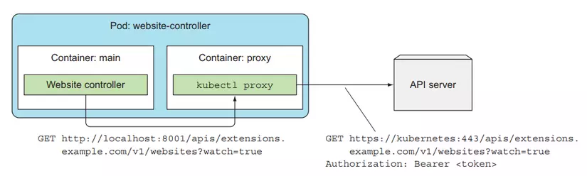

# k8s-custom-resource

Tạo một custom resource sử dụng CustomResourceDefinition,  viết CustomResourceDefinition và định nghĩa những giá trị custom resource trong đó. Sau đó tạo CustomResourceDefinition này, rồi viết một controller để theo dõi custom resource của mới tạo và thực hiện hành động liên quan tới nó.

